#Jsmooth，将Java转成无需jre的可执行文件

1、将java程序导出jar包，打包的方式有两种，一种是将当前项目文件以及相关引用全部打入同一个jar包，另外一种是将当前项目文件打成单独jar包。两种方法都可以。但是建议使用第二种，这种方式维护和升级都比较方便，只更新jar包即可，当然第一种也有好处，第一种在生成exe选项的时候，可以将所有的jar文件打包到.exe中去，可以使程序看起来简单。

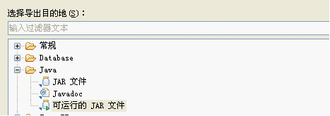

2、新建一个目录（如：D:\test\program），将所用到的所有转化文件放入到该目录中去。包括.exe的图标、jre、jar文件等。（注意此例子生成的.exe可以在无jre的环境下运行，jre已经被当成程序的一部分了，把所有文件放入同一个文件夹可以指定相对目录）目录结构如下：
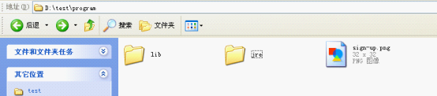

3、启动JSmooth,点击左侧的导航 “骨架”，在打开的页面中选择“Console Wrapper”, this is for console application

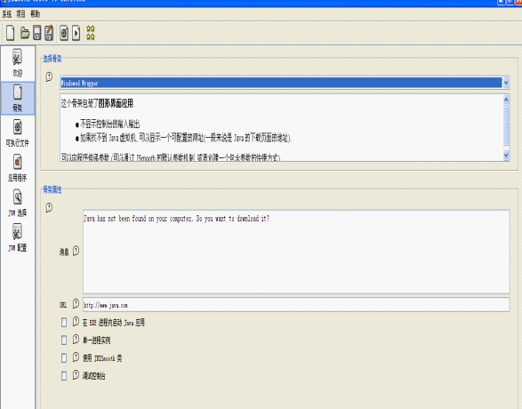

4、选择左侧导航“可执行文件”，在打开的页面中点击“可执行的二进制文件”的右侧浏览按钮，将路径选择到刚才建立的目录下（D:\test\program），此目录即是生成.exe程序的基本目录，自己起一个.exe的名称，如sign.exe.

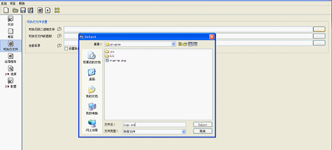

5、选择可执行文件的图标，选择同一个目录中的图标

6、选中“设置执行文件所在的目录为应用程序的当前目录”，此选项可以将当前的.exe所在的目录设置为应用程序的根目录，其他文件的目录为相对该目录的相对目录，这样就可以做到不管程序被拷贝到哪里，都可以运行，而不是一个绝对目录
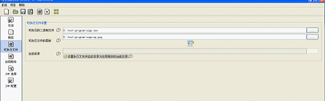

7、点击保存按钮，为什么要在此时保存呢？这个可能是JSmooth的一个小问题，上一步骤中选中的相对目录，貌似是工程文件（JSmoonth工程）所在的目录。把工程文件保存在该目录下，即可完成对所有选中文件相对路径设置。点击保存按钮，将文件保存在相对目录中去，名字可以任意取。例子中将该工程文件保存在D:\test\program\abc.jsmooth,再强调一下工程文件一定要保存在根目录里，相对路径的问题才能解决。保存完毕后，看下图（注意要切换下页面才能看到这个信息，如点一下"骨架"，再点"可执行文件"，路径已经变成相对路径了，原来的 D:\test\program\sign.exe 已经变成 sign.exe）：

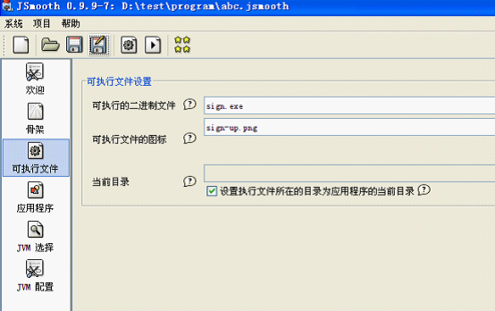

8、点击左侧导航 “应用程序”，在打开的页面中，选配置Classpath路径，即你的java项目文件的jar包以及所有引用的jar包（不包括jre，jre后面会单独处理）。其中使用嵌入的jar文件选项可以将选中的一个jar文件直接打包到 .exe中去，这种对于只使用一个jar包的程序或者把所有的引用以及程序打包成一个jar文件的做法，比较好，这样classpath就不用设这了。当然你也可以即设置嵌入式 jar，又设置Classpath类路径。注意Classpath的先后顺序，一般将自己项目中的文件所在的jar包移动到最上面，这样一些资源文件就会以自己项目中的资源文件为准，如log4j.xml ， zh_cn.property文件等。选择住类，即main函数所在的那个类，并填写好启动参数，即main函数所需要的参数，没有可以不填。

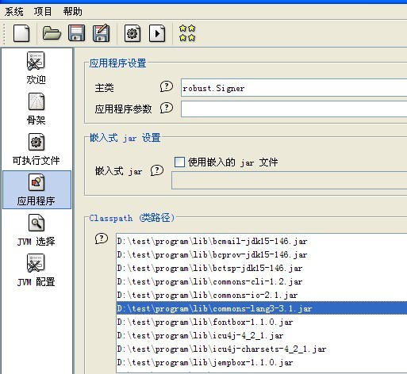

9、点击左侧导航菜单“jvm选择”，可以为应用程序指定一个相对目录下的jre 。这样应用程序不管拷贝到哪里，都可以直接运行（注意选号路径后，路径信息直接就是相对路径，如果出现了绝对路径，则是上面某些步骤出现了问题）

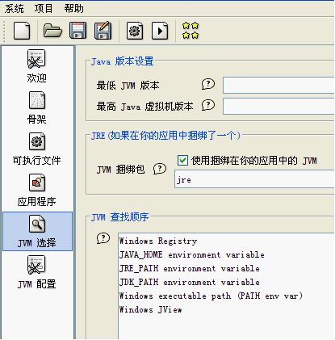

10、JVM配置可以设置JVM的内存，启动参数等信息。

11、点击保存-编译。

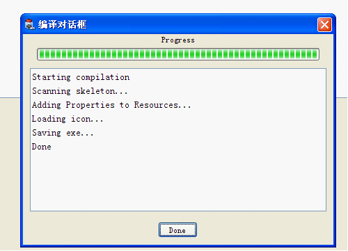

12、在文件目录下就会生成一个.exe文件。

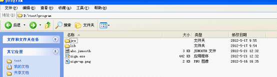

13、其中没有用的文件是jsmooth的工程文件,abc.jsmooth,图片文件（因为图片已经被打包到.exe中去了）。删除这2个文件，之后整个程序就已经做好了，无论将该程序拷到任意目录或者拷贝到没有jre的计算机上都能正常运行。其实如果程序中没有绑定jre，程序在运行时也会去找系统的jre的。

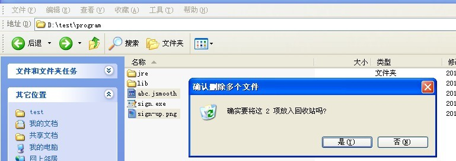

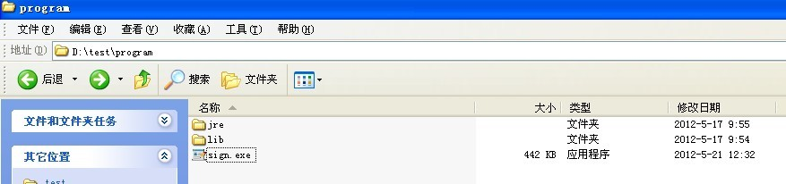